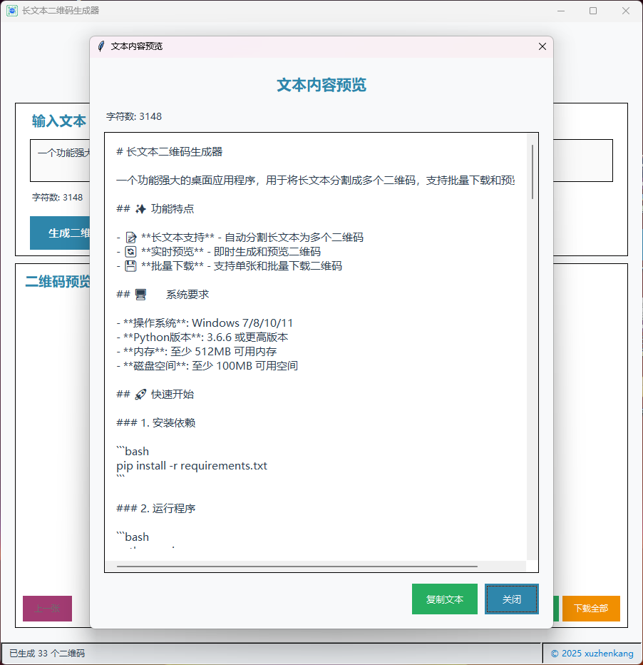

# 长文本二维码生成器

一个功能强大的桌面应用程序，用于将长文本分割成多个二维码，支持批量下载和预览功能。

## ✨ 功能特点

- 📝 **长文本支持** - 自动分割长文本为多个二维码
- 🔄 **实时预览** - 即时生成和预览二维码
- 💾 **批量下载** - 支持单张和批量下载二维码

## 🖥️ 系统要求

- **操作系统**: Windows 7/8/10/11
- **Python版本**: 3.6.6 或更高版本
- **内存**: 至少 512MB 可用内存
- **磁盘空间**: 至少 100MB 可用空间

## 🚀 快速开始

### 1. 安装依赖

```bash
pip install -r requirements.txt
```

### 2. 运行程序

```bash
python main.py
```

## 📦 打包为exe文件

### 方法1: 使用build_exe.py脚本（推荐）

```bash
# 运行打包脚本
python build_exe.py
```

这个脚本会自动：
- 检查Python版本
- 安装PyInstaller（如果未安装）
- 配置所有必要的参数
- 生成exe文件到dist目录

### 方法2: 手动使用PyInstaller

```bash
# 安装PyInstaller
pip install pyinstaller

# 打包程序
pyinstaller --onefile --windowed --name=text_copier_v1.0.0 --icon=icon.ico main.py
```

### 打包参数说明

- `--onefile`: 打包成单个exe文件
- `--windowed`: 不显示控制台窗口
- `--name=text_copier_v1.0.0`: 设置exe文件名
- `--icon=icon.ico`: 设置程序图标
- `--hidden-import`: 确保必要的模块被包含
- `--clean`: 清理临时文件

### 打包输出

打包完成后，exe文件将生成在：
```
dist/text_copier_v1.0.0.exe
```

## 📖 使用说明

### 演示动画


### 基本操作

1. **输入文本** - 在文本框中输入要生成二维码的内容
2. **生成二维码** - 点击"生成二维码"按钮
3. **预览二维码** - 使用导航按钮浏览不同的二维码
4. **下载二维码** - 点击"下载当前"或"下载全部"按钮
5. **客户端** - 手机浏览器访问：https://jovial-conkies-77fbc9.netlify.app/ 

### 高级功能

- **文本预览** - 点击"展示全部"查看完整文本内容
- **鼠标滚轮** - 在二维码预览区域使用滚轮切换二维码
- **复制文本** - 在文本预览窗口中复制文本到剪贴板
- **清空内容** - 一键清空所有输入和生成的二维码

## 🔧 技术规格

### 二维码设置
- **最大字符数**: 每个二维码最多800个字符
- **错误纠正**: 中等级别错误纠正
- **图像格式**: PNG格式输出
- **图像质量**: 高分辨率，支持缩放

### 界面特性
- **响应式设计** - 支持窗口大小调整
- **主题色彩** - 现代化的蓝色主题
- **字体支持** - 使用Microsoft YaHei UI字体
- **滚动支持** - 文本预览窗口支持水平和垂直滚动

### 界面展示




## 📁 项目结构

```
text_copier/
├── main.py                     # 主程序文件
├── requirements.txt            # 依赖包列表
├── README.md                   # 项目说明文档
└── dist/                       # 打包输出目录（生成后）
    └── text_copier_v1.0.0.exe  # 可执行文件
```

## 📋 依赖包

- **qrcode** - 二维码生成库
- **Pillow** - 图像处理库
- **tkinter** - GUI框架（Python内置）

## 🛠️ 故障排除

### 常见问题

#### 1. 导入错误
```bash
# 如果出现 "Import qrcode could not be resolved"
pip install qrcode[pil]

# 如果出现 "Import PIL could not be resolved"
pip install Pillow
```

#### 2. 打包失败
```bash
# 确保安装了所有依赖
pip install qrcode[pil] pyinstaller

# 使用管理员权限运行
# 右键点击命令提示符，选择"以管理员身份运行"
```

#### 3. 程序无法启动
- 检查Python版本是否为3.6.6或更高
- 确保所有依赖包已正确安装
- 检查防火墙设置

### 网络问题
如果下载依赖包时遇到网络问题，可以使用国内镜像源：

```bash
pip install -i https://pypi.tuna.tsinghua.edu.cn/simple qrcode[pil]
pip install -i https://pypi.tuna.tsinghua.edu.cn/simple pyinstaller
```

## 🎯 使用场景

- **文档分享** - 将长文档分割成多个二维码分享
- **代码传输** - 传输长代码片段
- **文本备份** - 将重要文本转换为二维码备份
- **离线传输** - 在没有网络的环境下传输文本信息
- **演示展示** - 在演示中使用二维码展示内容

## 🔒 隐私说明

- 所有文本内容仅在本地处理
- 不会上传任何数据到服务器
- 生成的二维码文件保存在用户指定位置
- 程序不会收集任何个人信息

## 📝 更新日志

### v1.0.0
- ✅ 基础二维码生成功能
- ✅ 长文本自动分割
- ✅ 批量下载功能
- ✅ 现代化界面设计
- ✅ 文本预览功能
- ✅ 鼠标滚轮支持
- ✅ 窗口居中显示

## 🤝 贡献

欢迎提交问题报告和功能建议！

## 📄 许可证

© 2025 xuzhenkang

本项目采用开源许可证，可自由使用和修改。

## 📞 联系方式

如有问题或建议，请通过以下方式联系：
- GitHub Issues: https://github.com/xuzhenkang/text_copier/issues
- 邮箱: [xuzhenkang@hotmail.com]

---

**感谢使用长文本二维码生成器！** 🎉 

配合`text_copier`使用效果更好，地址：https://github.com/xuzhenkang/text_copier
